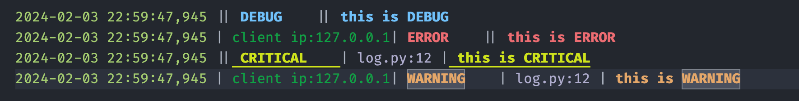

# Remote Log Server With Colorful Log

<div align=center>  </div>

------

[中文 README](README_CN.md) | [English README](README.md)

------

Provides a Socket TCP Server port in VSCode to listen to client logs and highlight them in the output channel; also provides a language mode for highlighting existing log files.

## Features

The plugin highlights based on the `|` separator. A single line of log with 4 `|` symbols can be highlighted.

Logs generally contain information such as time, log level, line number, log content, etc. The default output format of various frameworks is different, but can all be customized for formatting.

`|` also has a good visual effect for text separation in text without color highlighting, so the plugin uses `|` for log highlighting. If a single line of text has four `|` symbols, the text will be split into the following semantics for highlighting.

```tex
texCopy code
Definition:
time | other | level | fileno | msg

Example:
2024-02-03 22:59:47,945 || DEBUG    || this is DEBUG
2024-02-03 22:59:47,945 | client ip:127.0.0.1| ERROR    || this is ERROR
2024-02-03 22:59:47,945 || CRITICAL    | log.py:12 | this is CRITICAL
2024-02-03 22:59:47,945 | client ip:127.0.0.1| WARNING    | log.py:12 | this is WARNING
```



### Remote Log Server

1. Start the `Remote Log Server` (click the Remote Log Server: Start button in the status bar below).
2. Select `TCP Log Server Output` in the output channel.
3. Wait for client connection and send logs.

You can use the following `Python (Test Version: 3.10.10)` code for testing.

```python
pythonCopy code
#!/usr/bin/env python3
# coding=utf-8
import logging
import logging.handlers

class RemoteTCPServerLogHandler(logging.StreamHandler):
    """
    """
    def __init__(self, host, port=logging.handlers.DEFAULT_TCP_LOGGING_PORT):
        logging.StreamHandler.__init__(self)
        import socket
        self.client = socket.socket(socket.AF_INET,socket.SOCK_STREAM) 
        self.tcpServerAddr = (host, port) 
        self.client.connect(self.tcpServerAddr)  
        self.stream = self.client.makefile("wr")
        selfIP = self.client.getsockname()[0]
        self.formatter = logging.Formatter("%(asctime)s | " + f"Client IP:{selfIP} | " +"%(levelname)-8s |%(filename)s:%(lineno)-4d | %(message)s")

if __name__ == "__main__":
    import time
    logger = logging.getLogger('socket_logger')
    logger.addHandler(RemoteTCPServerLogHandler("127.0.0.1"))
    logger.setLevel(logging.DEBUG)
    # from loguru import logger
    while 1:
        time.sleep(0.5)
        logger.debug('This is a debug message')
        time.sleep(0.5)
        logger.info('This is an info message')
        time.sleep(0.5)
        logger.warning('This is a warning message')
        time.sleep(0.5)
        logger.error('This is an error message')
        time.sleep(0.5)
        logger.critical('This is a critical message')
```

### Colorful Log Mode

- Open the log file and select the language mode as `ColorfulLog`


### How to Customize Colors

Edit in `settings.json`

```json
jsonCopy code
    "editor.tokenColorCustomizations": {
        "textMateRules": [
            {
                "name": "ColorfulLog.log-time",
                "scope": "ColorfulLog.log-time",
                "settings": {
                    "fontStyle": "",
                    "foreground": "#a5cd70"
                }
            },
            {
                "name": "ColorfulLog.log-other-info",
                "scope": "ColorfulLog.log-other-info",
                "settings": {
                    "fontStyle": "",
                    "foreground": "#0aa344"
                }
            },
            {
                "name": "ColorfulLog.log-level.DEBUG",
                "scope": "ColorfulLog.log-level.DEBUG",
                "settings": {
                    "fontStyle": "bold",
                    "foreground": "#6fc1fa"
                }
            },
            {
                "name": "ColorfulLog.log-level.INFO",
                "scope": "ColorfulLog.log-level.INFO",
                "settings": {
                    "fontStyle": "bold",
                    "foreground": "#acb2be"
                }
            },
            {
                "name": "ColorfulLog.log-level.ERROR",
                "scope": "ColorfulLog.log-level.ERROR",
                "settings": {
                    "fontStyle": "bold",
                    "foreground": "#ed6c72"
                }
            },
            {
                "name": "ColorfulLog.log-level.WARNING",
                "scope": "ColorfulLog.log-level.WARNING",
                "settings": {
                    "fontStyle": "bold",
                    "foreground": "#e5a769"
                }
            },
            {
                "name": "ColorfulLog.log-level.CRITICAL",
                "scope": "ColorfulLog.log-level.CRITICAL",
                "settings": {
                    "fontStyle": "bold underline",
                    "foreground": "#cfe31b"
                }
            },
            {
                "name": "ColorfulLog.log-level.SUCCESS",
                "scope": "ColorfulLog.log-level.SUCCESS",
                "settings": {
                    "fontStyle": "bold",
                    "foreground": "#b1de82"
                }
            },
            {
                "name": "ColorfulLog.log-fileno",
                "scope": "ColorfulLog.log-fileno",
                "settings": {
                    "fontStyle": "",
                    "foreground": "#b0aecf"
                }
            }
        ]
    }
```

## Plugin Configuration

Search for `Remote Log Server With Colorful Log` in plugin configuration.

Remote Log Server With Colorful Log: Host is the Host address of the local TCP server.

Remote Log Server With Colorful Log: Port is the Port number of the local TCP server.

## Changelog

Check the `CHANGELOG` tag for any version changes.

## Reporting issues

Report any issues on the GitHub [issues page](https://github.com/JunJie-zhang-o/Remote-Log-Server-With-Colorful-Log/issues). Follow the template and add as much information as possible.

## Contributing

The source code for this extension is hosted on [GitHub](https://github.com/JunJie-zhang-o/Remote-Log-Server-With-Colorful-Log). Contributions, pull requests, suggestions, and bug reports are greatly appreciated.

- Post any issues and suggestions to the GitHub [issues page](https://github.com/JunJie-zhang-o/Remote-Log-Server-With-Colorful-Log/issues). Add the `feature request` tag to any feature requests or suggestions.
- To contribute, fork the project and then create a pull request back to master. Please update the README if you make any noticeable feature changes.
- There is no official contribution guide or code of conduct yet, but please follow the standard open-source norms and be respectful in any comments you make.

## License

This project is licensed under the MIT License - see the [LICENSE](https://github.com/JunJie-zhang-o/Remote-Log-Server-With-Colorful-Log/blob/main/LICENSE) file for details.

## Enjoy！！！
